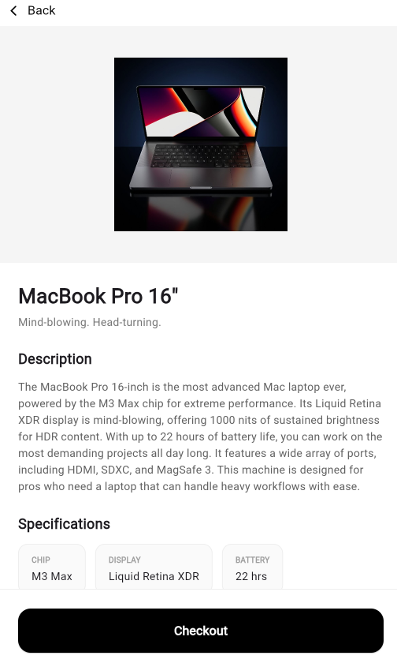
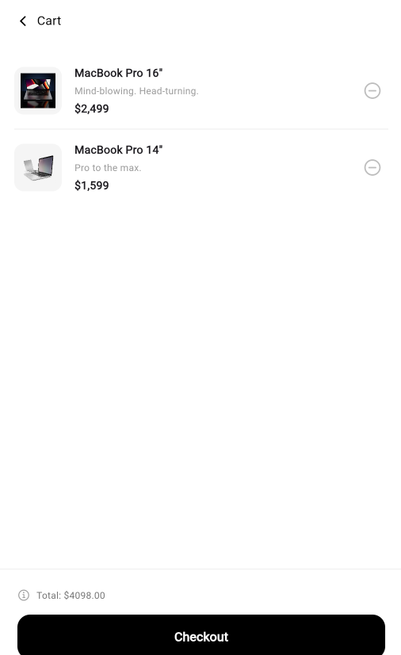

# Mini Katalog Uygulaması

## Açıklama
[cite_start]Bu proje, Flutter kullanılarak temel seviyede geliştirilmiş bir mobil katalog uygulamasıdır[cite: 3]. [cite_start]Proje; widget yapısı, sayfa geçişleri, temel UI tasarımı, veri modeli oluşturma ve proje klasörleme mantığını içermektedir[cite: 5]. [cite_start]Ekstra bir paket kullanılmamış olup, eğitim kapsamı gereği sadece `material.dart` paketi ile hazırlanmıştır[cite: 15, 16].

## Kullanılan Sürüm ve Araçlar
- **Flutter Sürümü:** 3.11.1
- [cite_start]**Kullanılan Paket:** Sadece `material.dart` [cite: 15]

## Çalıştırma Adımları

Projeyi kendi bilgisayarınızda sorunsuz bir şekilde derleyip çalıştırmak için aşağıdaki adımları sırasıyla uygulayın:

### 1. Sistem Gereksinimleri
[cite_start]Uygulamayı çalıştırmadan önce bilgisayarınızda şu araçların kurulu olması zorunludur[cite: 7]:
- [cite_start]Flutter SDK [cite: 9]
- [cite_start]Dart SDK [cite: 10]
- [cite_start]Kod düzenleyici olarak Visual Studio Code [cite: 11]
- [cite_start]Test ortamı için Android Studio (Emulator için) veya Fiziksel Android Cihaz [cite: 12, 13]

### 2. Projeyi İndirme ve Hazırlama
1. Terminal (veya komut satırı) uygulamasını açın.
2. Proje klasörünün bulunduğu dizine geçiş yapın:
   ```bash
   cd mini_katalog

### Al knk, sinirlenme. Başka hiçbir şey eklemiyorum, direkt kopyalayıp `README.md` dosyana yapıştırabileceğin tam ve eksiksiz format aşağıda:

```markdown
# Mini Katalog Uygulaması

## Kısa Açıklama
Bu proje, Flutter kullanılarak temel seviyede geliştirilmiş bir mobil katalog uygulamasıdır. Proje; widget yapısı, sayfa geçişleri, temel UI tasarımı, veri modeli oluşturma ve proje klasörleme mantığını içermektedir. Ekstra bir paket kullanılmamış olup, eğitim kapsamı gereği sadece `material.dart` paketi ile hazırlanmıştır.

## Kullanılan Sürüm ve Araçlar
- **Flutter Sürümü:** 3.11.1
- **Kullanılan Paket:** Sadece `material.dart`

## Çalıştırma Adımları

Projeyi kendi bilgisayarınızda sorunsuz bir şekilde derleyip çalıştırmak için aşağıdaki adımları sırasıyla uygulayın:

### 1. Sistem Gereksinimleri
Uygulamayı çalıştırmadan önce bilgisayarınızda şu araçların kurulu olması zorunludur:
- Flutter SDK
- Dart SDK
- Kod düzenleyici olarak Visual Studio Code
- Test ortamı için Android Studio (Emulator için) veya Fiziksel Android Cihaz

### 2. Projeyi İndirme ve Hazırlama
1. Terminal (veya komut satırı) uygulamasını açın.
2. Proje klasörünün bulunduğu dizine geçiş yapın:
   ```bash
   cd mini_katalog

```
Projedeki gerekli bağımlılıkları ve asset'leri senkronize etmek için aşağıdaki komutu çalıştırın:
```bash
flutter pub get

```


### 3. Cihaz Seçimi ve Başlatma

1. Uygulamayı test etmek için bir Android Emulator başlatın veya Android cihazınızı USB hata ayıklama (USB Debugging) modu açık bir şekilde bilgisayara bağlayın.
2. Cihazınızın Flutter tarafından tanındığını kontrol etmek için terminale şu komutu yazabilirsiniz (opsiyonel):
```bash
flutter devices

```


3. Son olarak, uygulamayı cihazınızda derlemek ve ayağa kaldırmak için aşağıdaki komutu çalıştırın:
```bash
flutter run

```

## Ekran Görüntüleri



